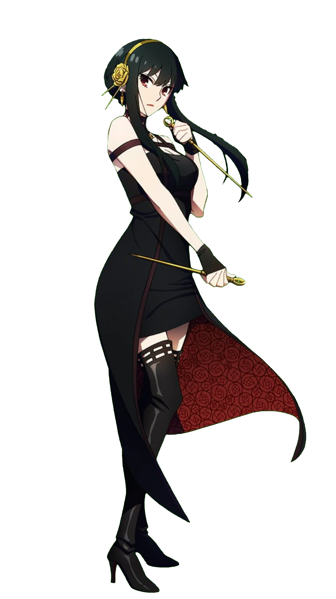

<h2 align="left">Hi 👋! I'm Emma Strienko — full-stack coder & content creator</h2>

###

 
 <pre>
    💻 Full-stack coder & content creator
    ✨ Passionate about clean, scalable code
    🚀 Love diving into JavaScript, React & Python
    🎥 Sharing my dev journey on YouTube
    ☕ Fueled by coffee & anime soundtracks 🎵
    🌱 Always learning, building, and inspiring

   
   
 </pre>

###

###

  
  
  
  
  
  
  
  
  
  
  
  
  
  

###

  
  

 

## 🧬 About Me

  

  <pre style="background:#1e1e2f; color:#cfcfcf; padding: 20px; border-radius: 8px; font-family: 'Fira Mono', monospace; white-space: pre-wrap; margin: 0;">
[ SYSTEM LOG BOOTING... ]
> User: Emma Strienko
> Alias: emmastrienko
> Role: Computer Science Student | Full-stack Explorer | Content Creator
> Specialty: JavaScript, React, Node.js, Python
> Operating System: CuriosityOS v2.5
> Status: ⚡Active | ⚔️Training Mode
> Mission: Learn, build, inspire
> Side Quest: Creating content that empowers future devs
> Output Channel: 📹 YouTube @emmastrienko
> MBTI Personality: ENFJ-INFJ Hybrid — The Visionary Guide
> Current XP: +3400 GitHub commits
> Companion: Anime OSTs + Late Night Debug Sessions
> Weakness Detected: 💤 Needs coffee to function
> Visual Theme: 🌙 Dark mode always
> Background: Once lost in fantasy books — now building real-world magic with code
> Armor Equipped: Curiosity, clear goals, and the will to never give up
> Daily Routine: Code. Create. Connect. Repeat.
> Boot complete. Welcome, traveler.
</pre>

